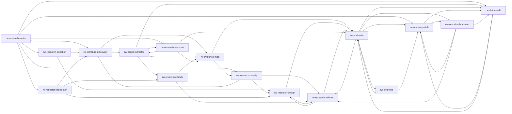

# RW Research Skill 关系图

```mermaid
flowchart LR
  router["rw-research-router"]
  question["rw-research-question"]
  discovery["rw-literature-discovery"]
  extractor["rw-paper-extractor"]
  evidence["rw-evidence-map"]
  novelty["rw-research-novelty"]
  review["rw-review-methods"]
  design["rw-research-design"]
  referee["rw-research-referee"]
  passport["rw-research-passport"]
  audit["rw-claim-audit"]
  patch["rw-revision-patch"]
  write["rw-phd-write"]
  tone["rw-phd-tone"]
  submission["rw-journal-submission"]
  tools["rw-research-lab-router"]

  router --> question
  router --> discovery
  router --> novelty
  router --> passport
  router --> audit
  router --> patch
  router --> tools
  question --> discovery
  question --> design
  discovery --> extractor
  discovery --> evidence
  extractor --> evidence
  extractor --> audit
  extractor --> passport
  extractor --> review
  evidence --> novelty
  evidence --> write
  novelty --> discovery
  novelty --> design
  novelty --> referee
  review --> evidence
  review --> referee
  design --> referee
  design --> write
  referee --> design
  referee --> write
  write --> tone
  write --> audit
  write --> patch
  write --> referee
  write --> submission
  tone --> write
  tone --> patch
  audit --> patch
  audit --> write
  patch --> audit
  patch --> submission
  passport --> extractor
  passport --> evidence
  passport --> write
  submission --> patch
  submission --> audit
  submission --> referee
  tools --> discovery
  tools --> review
  tools --> design
```
